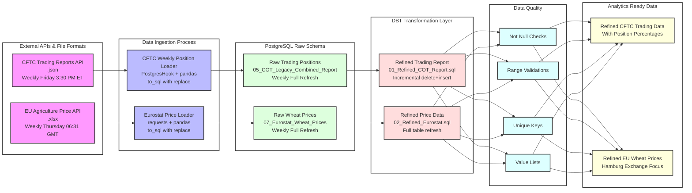

<h2 align="center">
  Welcome to Airflow DBT Project Project!
  
</h2>
<!-- Intro  -->
<h3 align="center">
        <samp>&gt; Hey There!, I am
                <b><a target="_blank" href="https://yourwebsite.com">Shubham Dalvi</a></b>
        </samp>
</h3>

<p align="center"> 
  <samp>
    <br>
    「 I am a data engineer with a passion for big data, distributed computing, cloud solutions, and data visualization 」
    <br>
    <br>
  </samp>
</p>

<div align="center">
<a href="https://git.io/typing-svg"></a>
</div>


<p align="center">
 <a href="https://www.linkedin.com/in/shubham-dalvi-21603316b" target="_blank">
  
 </a>
</p>
<br />

<!-- About Section -->
# About Me

<p>
 
  
 ✌️ &emsp; Enjoy solving data problems <br/><br/>
 ❤️ &emsp; Passionate about big data technologies, cloud platforms, and data visualizations<br/><br/>
 📧 &emsp; Reach me: shubhamdworkmail@gmail.com<br/><br/>
</p>

<br/>


# Airflow DBT Project

A production-ready data pipeline using Apache Airflow and DBT for processing CFTC reports.


## Data Flow



## Project Overview

This project implements an automated data pipeline that:
1. Ingests CFTC (Commodity Futures Trading Commission) report data
2. Processes and transforms the data using DBT
3. Runs data quality tests
4. Manages the entire workflow using Apache Airflow

## Data Sources

### 1. CFTC Trading Reports
- **Source**: CFTC Public API (publicreporting.cftc.gov)
- **Data Type**: Commitments of Traders (COT) Reports
- **Format**: JSON via Socrata API
- **Update Frequency**: Weekly (Every Friday at 3:30 PM Eastern)
- **Raw Table**: `raw.05_COT_Legacy_Combined_Report`
- **Content**: Trading positions data including:
  - Commercial and non-commercial positions
  - Long and short percentages
  - Open interest statistics
  - Focus on wheat, corn, and soybean markets

### 2. Eurostat Agricultural Prices
- **Source**: European Commission Agriculture Portal
- **Data Type**: EU Wheat Price Data
- **Format**: Excel (.xlsx) file
- **Update Frequency**: Weekly (Every Thursday at 06:31 London time)
- **Raw Table**: `raw.07_Eurostat_Wheat_Prices`
- **Content**: Agricultural commodity prices including:
  - Regional wheat prices across EU
  - Price points from major trading hubs
  - Historical price trends
  - Focus on Hamburg exchange prices

## PostgreSQL Data Population

### Raw Data Ingestion

1. **CFTC Trading Positions (`raw.05_COT_Legacy_Combined_Report`)**:
   ```python
   # Using Airflow's PostgresHook and pandas
   postgres_hook = PostgresHook(postgres_conn_id="db")
   df = pd.DataFrame.from_records(cftc_api_results)
   df.to_sql('05_COT_Legacy_Combined_Report', 
             postgres_hook.get_sqlalchemy_engine(),
             schema='raw',
             if_exists='replace',
             index=False)
   ```
   - Fetched via Socrata API client
   - Transformed to pandas DataFrame
   - Bulk loaded using SQLAlchemy engine
   - Replace strategy for weekly updates

2. **Eurostat Prices (`raw.07_Eurostat_Wheat_Prices`)**:
   ```python
   # Using requests and pandas
   response = requests.get(eurostat_url)
   df = pd.read_excel(BytesIO(response.content))
   df.to_sql('07_Eurostat_Wheat_Prices',
             postgres_hook.get_sqlalchemy_engine(),
             schema='raw',
             if_exists='replace',
             index=False)
   ```
   - Downloads Excel file via HTTP
   - Direct Excel to DataFrame conversion
   - Bulk loaded using SQLAlchemy engine
   - Replace strategy for weekly updates

### DBT Transformations

1. **Refined Trading Report (`public.01_Refined_COT_Report`)**:
   ```sql
   -- Incremental model with delete+insert strategy
   {{ config(
       materialized='incremental',
       unique_key=['date', 'commodity_name'],
       incremental_strategy='delete+insert'
   ) }}
   ```
   - Implements incremental loading
   - Ensures data uniqueness
   - Handles historical updates

2. **Refined Price Data (`public.02_Refined_Eurostat`)**:
   ```sql
   -- Full refresh table materialization
   {{ config(
       materialized='table'
   ) }}
   ```
   - Complete table refresh
   - Filters for specific price points
   - Focuses on Hamburg exchange data

### Data Quality Checks
- Not null constraints
- Value range validations (0-100 for percentages)
- Unique composite keys
- Accepted value lists for commodities

## Architecture

- **Apache Airflow**: Orchestrates the entire data pipeline
- **DBT**: Handles data transformation and testing
- **PostgreSQL**: Stores both raw and transformed data
- **Docker**: Containerizes all services for consistent deployment


## Prerequisites

- Docker and Docker Compose
- Python 3.10 or higher
- Git

## Quick Start

1. Clone the repository:
   ```bash
   git clone <repository-url>
   cd Docker_Airflow_Postgres-main
   ```

2. Create and configure the `.env` file:
   ```bash
   cp .env.example .env
   # Edit .env with your configurations
   ```

3. Start the services:
   ```bash
   docker-compose up -d
   ```

4. Access Airflow UI:
   - URL: http://localhost:8080
   - Default credentials: airflow/airflow

## Configuration

### Environment Variables

Key environment variables in `.env`:
```
AIRFLOW_UID=50000
AIRFLOW_GID=0
PYTHON_VERSION=3.10
DB_HOST=postgres
DB_USER=airflow
DB_PASSWORD=airflow
DB_PORT=5432
DB_NAME=airflow
DB_SCHEMA=public
```

### Service Configuration

1. **Airflow Webserver**:
   - Optimized Gunicorn settings
   - Health checks enabled
   - Automatic restart on failure

2. **DBT Service**:
   - Custom Dockerfile with required dependencies
   - Git integration for package management
   - Standardized container naming

3. **PostgreSQL**:
   - Configured for optimal performance
   - Proper connection pooling
   - Health monitoring enabled

## Project Structure

```
.
├── Airflow/
│   ├── dags/                 # Airflow DAG definitions
│   └── logs/                 # Airflow logs
├── dsec_dbt/
│   ├── models/              # DBT transformation models
│   ├── tests/               # Data quality tests
│   └── dbt_project.yml      # DBT configuration
├── docker/                   # Docker configuration files
├── docs/                     # Project documentation
├── docker-compose.yml        # Service orchestration
└── README.md                # This file
```

## DAGs

1. **CFTC Report Loader** (`06_CFTC_Rreport_Loader.py`):
   - Ingests CFTC report data
   - Runs DBT transformations
   - Executes data quality tests
   - Scheduled to run weekly

## Logging Structure

The Airflow logs are organized in a hierarchical structure under the `Airflow/logs` directory:

```
Airflow/logs/
├── dag_id=<dag_name>/                    # Specific DAG logs
│   ├── run_id=<run_identifier>/          # Each DAG run
│   │   └── task_id=<task_name>/         # Individual task logs
│   └── ...
├── scheduler/                            # Scheduler logs
│   ├── YYYY-MM-DD/                      # Date-based logs
│   └── ...
├── dag_processor_manager/               # DAG processing logs
└── ...
```

### Log Types

1. **DAG Run Logs**:
   - Located in `dag_id=<dag_name>/run_id=<run_identifier>/`
   - Run IDs include both manual and scheduled runs
   - Format: `manual__YYYY-MM-DDTHHMMSS+0000` or `scheduled__YYYY-MM-DDTHHMMSS+0000`
   - Contains all task execution logs for that specific run

2. **Service Logs**:
   - **Scheduler**: Daily logs of task scheduling and DAG processing
   - **DAG Processor**: Logs related to DAG file processing
   - **Worker**: Task execution and resource usage (in worker container)

3. **Log Retention**:
   - Logs are retained based on configuration
   - Default retention period: 30 days
   - Configurable via environment variables

### Log Generation

1. **Task Execution Logs**:
   - Generated by the Airflow worker when executing tasks
   - Each task instance creates its own log file
   - Captures:
     ```
     - Task start/end times
     - Python stdout/stderr output
     - Custom log messages from task code
     - Error tracebacks
     - Operator-specific information (e.g., SQL queries, DBT output)
     ```

2. **Scheduler Logs**:
   - Generated by the Airflow scheduler process
   - Created in daily rotating files
   - Records:
     ```
     - DAG file processing events
     - Task scheduling decisions
     - Task state transitions
     - Retry attempts
     - Scheduler heartbeat information
     ```

3. **DAG Processor Logs**:
   - Generated when Airflow processes DAG files
   - Captures:
     ```
     - DAG parsing results
     - Import errors
     - DAG validation issues
     - File processing timing
     - Syntax errors in DAG files
     ```

4. **Worker Logs**:
   - Generated by Celery workers (in our case, Docker containers)
   - Contains:
     ```
     - Task execution environment details
     - Resource usage (CPU, memory)
     - Container-specific information
     - Connection pool status
     ```

### Log Generation Settings

Key settings that affect log generation:
```ini
# Logging level for different components
AIRFLOW__LOGGING__LOGGING_LEVEL=INFO          # General logging level
AIRFLOW__CELERY__WORKER_LOG_SERVER_PORT=8793  # Worker log server port

# Log format customization
AIRFLOW__LOGGING__LOG_FORMAT=[%%(asctime)s] {%%(filename)s:%%(lineno)d} %%(levelname)s - %%(message)s
AIRFLOW__LOGGING__SIMPLE_LOG_FORMAT=%%(asctime)s %%(levelname)s - %%(message)s

# Log handlers configuration
AIRFLOW__LOGGING__FAB_LOGGING_LEVEL=WARN      # Flask AppBuilder logging
AIRFLOW__LOGGING__PROCESSOR_LOG_FOLDER=/opt/airflow/logs/dag_processor_manager
```

### Log Handlers

1. **Task Handler**:
   ```python
   # Example from DAG
   @task(task_id='example_task')
   def example_task(**context):
       # Logs are automatically captured
       logging.info("Task started")
       # Task code here
       logging.error("Error occurred")
   ```

2. **Custom Logging**:
   ```python
   # In your DAG file
   from airflow.utils.log.logging_mixin import LoggingMixin

   class CustomOperator(LoggingMixin):
       def execute(self, context):
           self.log.info("Custom message")
           # Your operator code
   ```

### Accessing Logs

1. **Via Airflow UI**:
   - Navigate to DAG > Graph View
   - Click on task
   - Select "View Log"
   - Use log navigation to view different runs

2. **Via Docker Commands**:
   ```bash
   # View DAG task logs
   docker-compose logs airflow-worker
   
   # View scheduler logs
   docker-compose logs airflow-scheduler
   
   # View specific container logs
   docker-compose logs [service-name]
   ```

3. **Direct File Access**:
   ```bash
   # Access logs directory
   docker-compose exec airflow-worker ls -l /opt/airflow/logs/dag_id=<dag_name>
   
   # View specific run logs
   docker-compose exec airflow-worker ls -l /opt/airflow/logs/dag_id=<dag_name>/run_id=<run_id>
   ```

### Log Configuration

Key environment variables for logging:
```ini
AIRFLOW__LOGGING__BASE_LOG_FOLDER=/opt/airflow/logs
AIRFLOW__LOGGING__DAG_FILE_PROCESSOR_LOG_RETENTION_DAYS=30
AIRFLOW__LOGGING__LOGGING_LEVEL=INFO
```

## Troubleshooting

Common issues and solutions are documented in:
- `docs/debugging_steps.md`: Detailed debugging guide
- `docs/docker_commands.md`: Useful Docker commands

## Health Checks

All services include health checks:
- Airflow Webserver: Gunicorn process monitoring
- DBT: Git availability check
- PostgreSQL: Connection verification
- Redis: Ping check

## Best Practices

1. **Container Management**:
   - Use of health checks
   - Proper restart policies
   - Resource limits configured

2. **Network Configuration**:
   - Standardized network setup
   - Internal service discovery
   - Proper DNS resolution

3. **Resource Management**:
   - Memory limits configured
   - CPU allocation optimized
   - Disk space monitoring

4. **Error Handling**:
   - Comprehensive logging
   - Retry mechanisms
   - Proper cleanup procedures

## Contributing

1. Fork the repository
2. Create a feature branch
3. Submit a pull request

## License

[Your License Here]

## Support

For issues and questions:
- Check the debugging guide in `